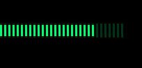
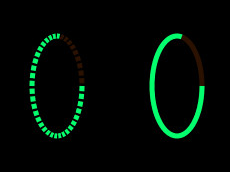

conky-draw
==========

Easily create beautiful conky graphs and drawings.

The main idea is this: stop copying and pasting random code from the web to your monolithic conkyrc + something.lua. Start using a nicely defined set of visual elements, in a very clean config file, separated from the code that has the drawing logic. "You ask, conky_draw draws".

Also, `Daguhh <http://github.com/Daguhh>`_ made a GUI to generate the configs! `ConkyLuaMakerGUIv2 <https://github.com/Daguhh/ConkyLuaMakerGUIv2>`_

Examples
--------

Simple disk usage.

.. code:: lua

    {
        kind = 'bar_graph',
        conky_value = 'fs_used_perc /home/',
        from = {x = 0, y = 45},
        to = {x = 180, y = 45},
        background_thickness = 20,
        bar_thickness = 16,
    },

Normal vs critical mode. You can even decide what changes when critical values are reached.

.. code:: lua

    {
        kind = 'bar_graph',
        conky_value = 'fs_used_perc /home/',
        from = {x = 50, y = 120},
        to = {x = 120, y = 45},

        background_thickness = 5,
        background_color = 0x00E5FF,

        bar_thickness = 5,
        bar_color = 0x00E5FF,

        critical_threshold = 60,

        change_color_on_critical = true,
        change_thickness_on_critical = true,

        background_color_critical = 0xFFA0A0,
        background_thickness_critical = 10,

        bar_color_critical = 0xFF0000,
        bar_thickness_critical = 13
    },

Idem with graduation

.. code:: lua

    {
        kind = 'bar_graph',
        conky_value = 'fs_used_perc /home/',
        from = {x = 50, y = 120},
        to = {x = 120, y = 45},

        background_thickness = 5,
        background_color = 0x00E5FF,

        bar_thickness = 5,
        bar_color = 0x00E5FF,

        critical_threshold = 60,

        change_color_on_critical = true,
        change_thickness_on_critical = true,

        background_color_critical = 0xFFA0A0,
        background_thickness_critical = 10,

        bar_color_critical = 0xFF0000,
        bar_thickness_critical = 13,

	graduated= true,
	number_graduation= 30,
	space_between_graduation=2,
    },

    

	   

Everybody loves ring graphs in conky.

.. code:: lua

    {
        kind = 'ring_graph',
        conky_value = 'fs_used_perc /home/',
        center = {x = 75, y = 100},
        radius = 30,
    },

    
Ring with graduation

.. code:: lua

  {
       kind = 'ring_graph',
       center = {x = 50, y = 50},
       conky_value = 'fs_used_perc /home/',
       radius = 30,
       graduated = true,
       number_graduation=40,
       angle_between_graduation=3,
       start_angle = 0,
       end_angle = 360,
       color= 0xFF6600,
       background_color= 0xD75600,
   },
    

Lord of the customized rings.

.. code:: lua

    {
        kind = 'ring_graph',
        conky_value = 'fs_used_perc /home/',
        center = {x = 75, y = 100},
        radius = 30,

        background_color = 0xFFFFFF,
        background_alpha = 1,
        background_thickness = 35,

        bar_color = 0x00E5FF,
        bar_alpha = 1,
        bar_thickness = 15,
    },

Or even ring fragments.

.. code:: lua

    {
        kind = 'ring_graph',
        conky_value = 'fs_used_perc /home/',
        center = {x = 75, y = 100},
        radius = 30,

        background_color = 0xFFFFFF,
        background_alpha = 0.7,
        background_thickness = 2,

        bar_color = 0xFFFFFF,
        bar_alpha = 1,
        bar_thickness = 6,

        start_angle = 140,
        end_angle = 300,
    },

Simple and graduated ellipse_graph 

.. code:: lua

  {
       kind = 'ellipse_graph',
       center = {x = 10, y = 10},
       conky_value = 'fs_used_perc /home/',
       radius = 5,
       width= 10,
       height= 20,
       graduated = true,
       number_graduation=40,
       angle_between_graduation=3,
       start_angle = 0,
       end_angle = 360,
       color= 0xFF6600,
       background_color= 0xD75600,
   },

   {
       kind = 'ellipse_graph',
       center = {x = 30, y = 10},
       conky_value = 'fs_used_perc /home/',
       radius = 5,
       width= 10,
       height= 20,
       start_angle = 0,
       end_angle = 360,
       color= 0xFF6600,
       background_color= 0xD75600,
   },

Right now you can define bar and ring graphs, and static lines and rings. Plans for the future:

* Draw text elements (on arbitrary positions/areas, not like traditional conkyrc).
* More basic elements: filled circles, rectangles, ...
* Other more complex visual elements (example: clocks)

Installation
------------

1. Copy both ``conky_draw.lua`` and ``conky_draw_config.lua`` to your ``.conky`` folder (your own ``conkyrc`` should be there too).
2. Include this in your conkyrc:

.. code::

    lua_load ./conky_draw.lua
    lua_draw_hook_post main

or this if you are using conky 1.10 or newer:

.. code:: lua

    conky.config = {
        -- (...)

        lua_load = 'conky_draw.lua',
        lua_draw_hook_pre = 'main',
    };

3. Customize the ``conky_draw_config.lua`` file as you wish. You just need to add elements in the ``elements`` variable (examples above).
4. Be sure to run conky from **inside** your ``.conky`` folder. Example: ``cd .conky && conky -c conkyrc``

Full list of available elements and their properties
----------------------------------------------------

Properties marked as **required** must be defined by you. The rest have default values, you can leave them undefined, or define them with the values you like.

But first, some general notions on the values of properties.

+------------------------+----------------------------------------------------------------------------------------------------------------------------------------------------+
| If the property is a...| This is what you should know                                                                                                                       |
+========================+====================================================================================================================================================+
| point                  | Its value should be something with x and y values.                                                                                                 |
|                        | Example: ``from = {x=100, y=100}``                                                                                                                 |
+------------------------+----------------------------------------------------------------------------------------------------------------------------------------------------+
| color                  | Its value should be a color in hexa.                                                                                                               |
|                        | Example (red): ``color = 0xFF0000``                                                                                                                |
+------------------------+----------------------------------------------------------------------------------------------------------------------------------------------------+
| alpha level            | Its value should be a transpacency level from 0 (fully transparent) to 1 (solid, no transpacency).                                                 |
|                        | Example: ``alpha = 0.2``                                                                                                                           |
+------------------------+----------------------------------------------------------------------------------------------------------------------------------------------------+
| angle                  | Its value should be expresed in **degrees**. Angle 0 is east, angle 90 is south, angle 180 is west, and angle 270 is north.                        |
|                        | Example: ``start_angle = 90``                                                                                                                      |
+------------------------+----------------------------------------------------------------------------------------------------------------------------------------------------+
| thickness              | Its value should be the thickness in pixels.                                                                                                       |
|                        | Example: ``thickness = 5``                                                                                                                         |
+------------------------+----------------------------------------------------------------------------------------------------------------------------------------------------+
| conky value            | Its value should be a string of a conky value to use, and when used for graphs, should be something that yields a number. All the possible conky   |
|                        | values are listed `here <http://conky.sourceforge.net/variables.html>`_.                                                                           |
|                        | Example: ``conky_value = 'upspeedf eth0'``                                                                                                         |
+------------------------+----------------------------------------------------------------------------------------------------------------------------------------------------+
| max value              | It should be maximum possible value for the conky value used in a graph. It's needed to calculate the length of the bars in the graphs, so be sure |
|                        | it's correct (for cpu usage values it's 100, for network speeds it's your top speed, etc.).                                                        |
|                        | Example: ``max_value = 100``                                                                                                                       |
+------------------------+----------------------------------------------------------------------------------------------------------------------------------------------------+
| critical threshold     | It should be the value at which the graph should change appearance. If you don't want that, just leave it equal to max_value to disable appearance |
|                        | changes.                                                                                                                                           |
|                        | Example: ``critical_threshold = 90``                                                                                                               |
+------------------------+----------------------------------------------------------------------------------------------------------------------------------------------------+
| boolean                | It should be either true or false, with no quotes.                                                                                                 |
|                        | Example: ``change_color_on_critical = true``                                                                                                       |
+------------------------+----------------------------------------------------------------------------------------------------------------------------------------------------+

Now, the elements and properties
--------------------------------

line:
-----

+--------------------------------+----------------------------------------------------------------------------------------------------------------------------------------+
| A simple straight line from point A to point B.                                                                                                                         |
+--------------------------------+----------------------------------------------------------------------------------------------------------------------------------------+
| from (required)                | A point where the line should start.                                                                                                   |
+--------------------------------+----------------------------------------------------------------------------------------------------------------------------------------+
| to (required)                  | A point where the line should end.                                                                                                     |
+--------------------------------+----------------------------------------------------------------------------------------------------------------------------------------+
| color                          | Color of the line.                                                                                                                     |
+--------------------------------+----------------------------------------------------------------------------------------------------------------------------------------+
| alpha                          | Transpacency level of the line.                                                                                                        |
+--------------------------------+----------------------------------------------------------------------------------------------------------------------------------------+
| thickness                      | Thickness of the line.                                                                                                                 |
+--------------------------------+----------------------------------------------------------------------------------------------------------------------------------------+
| graduated                      | specify if the element is  graduated.                                                                                                  |
+--------------------------------+----------------------------------------------------------------------------------------------------------------------------------------+
| number_graduation              | specify the number of  graduation.                                                                                                     |
+--------------------------------+----------------------------------------------------------------------------------------------------------------------------------------+
| space_between_graduation       | specify the space between  graduation.                                                                                                 |
+--------------------------------+----------------------------------------------------------------------------------------------------------------------------------------+

bar_graph:
----------

+--------------------------------+----------------------------------------------------------------------------------------------------------------------------------------+
| A bar graph, able to display a value from conky, and optionaly able to change appearance when the value hits a "critical" threshold.                                    |
| It's composed of two lines (rectangles), one for the background, and the other to represent the current value of the conky stat.                                        |
+--------------------------------+----------------------------------------------------------------------------------------------------------------------------------------+
| from (required)                | A point where the bar graph should start.                                                                                              |
+--------------------------------+----------------------------------------------------------------------------------------------------------------------------------------+
| to (required)                  | A point where the bar graph should end.                                                                                                |
+--------------------------------+----------------------------------------------------------------------------------------------------------------------------------------+
| conky_value (required)         | Conky value to use on the graph.                                                                                                       |
+--------------------------------+----------------------------------------------------------------------------------------------------------------------------------------+
| max_value and                  | For the conky value being used on the graph.                                                                                           |
| critical_threshold             |                                                                                                                                        |
+--------------------------------+----------------------------------------------------------------------------------------------------------------------------------------+
| background_color,              | For the appearance of the background of the graph in normal conditions.                                                                |
| background_alpha and           |                                                                                                                                        |
| background_thickness           |                                                                                                                                        |
+--------------------------------+----------------------------------------------------------------------------------------------------------------------------------------+
| bar_color, bar_alpha and       | For the appearance of the bar of the graph in normal conditions.                                                                       |
| bar_thickness                  |                                                                                                                                        |
+--------------------------------+----------------------------------------------------------------------------------------------------------------------------------------+
| change_color_on_critical,      | Booleans to control wether the color, alpha and thickness of both background and bar changes when the critical value is reached.       |
| change_alpha_on_critical and   |                                                                                                                                        |
| change_thickness_on_critical   |                                                                                                                                        |
+--------------------------------+----------------------------------------------------------------------------------------------------------------------------------------+
| background_color_critical,     | For the appearance of the background of the graph when the value is above critical threshold.                                          |
| background_alpha_critical and  |                                                                                                                                        |
| background_thickness_critical  |                                                                                                                                        |
+--------------------------------+----------------------------------------------------------------------------------------------------------------------------------------+
| bar_color_critical,            | For the appearance of the bar of the graph when the value is above critical threshold.                                                 |
| bar_alpha_critical and         |                                                                                                                                        |
| bar_thickness_critical         |                                                                                                                                        |
+--------------------------------+----------------------------------------------------------------------------------------------------------------------------------------+
| graduated                      | specify if the element is  graduated.                                                                                                  |
+--------------------------------+----------------------------------------------------------------------------------------------------------------------------------------+
| number_graduation              | specify the number of  graduation.                                                                                                     |
+--------------------------------+----------------------------------------------------------------------------------------------------------------------------------------+
| space_between_graduation       | specify the space between  graduation.                                                                                                 |
+--------------------------------+----------------------------------------------------------------------------------------------------------------------------------------+

ring:
-----

+--------------------------------+----------------------------------------------------------------------------------------------------------------------------------------+
| A simple ring (can be a section of the ring too).                                                                                                                       |
+--------------------------------+----------------------------------------------------------------------------------------------------------------------------------------+
| center (required)              | The center point of the ring.                                                                                                          |
+--------------------------------+----------------------------------------------------------------------------------------------------------------------------------------+
| radius (required)              | The radius of the ring.                                                                                                                |
+--------------------------------+----------------------------------------------------------------------------------------------------------------------------------------+
| color                          | Color of the ring.                                                                                                                     |
+--------------------------------+----------------------------------------------------------------------------------------------------------------------------------------+
| alpha                          | Transpacency level of the ring.                                                                                                        |
+--------------------------------+----------------------------------------------------------------------------------------------------------------------------------------+
| thickness                      | Thickness of the ring.                                                                                                                 |
+--------------------------------+----------------------------------------------------------------------------------------------------------------------------------------+
| start_angle                    | Angle at which the arc starts. Useful to limit the ring to just a section of the circle.                                               |
+--------------------------------+----------------------------------------------------------------------------------------------------------------------------------------+
| end_angle                      | Angle at which the arc ends. Useful to limit the ring to just a section of the circle.                                                 |
+--------------------------------+----------------------------------------------------------------------------------------------------------------------------------------+
| *Extra tip*: start_angle and end_angle can be swapped, to produce oposite arcs. If you don't understand this, just try what happens with this two examples:             |
|                                                                                                                                                                         |
| * ``start_angle=90, end_angle=180``                                                                                                                                     |
| * ``start_angle=180, end_angle=90``                                                                                                                                     |
+--------------------------------+----------------------------------------------------------------------------------------------------------------------------------------+
| graduated                      | specify if the element is  graduated.                                                                                                  |
+--------------------------------+----------------------------------------------------------------------------------------------------------------------------------------+
| number_graduation              | specify the number of  graduation.                                                                                                     |
+--------------------------------+----------------------------------------------------------------------------------------------------------------------------------------+
| angle_between_graduation       | specify the angle between  graduation.                                                                                                 |
+--------------------------------+----------------------------------------------------------------------------------------------------------------------------------------+

ring_graph:
-----------

+--------------------------------+----------------------------------------------------------------------------------------------------------------------------------------+
| A ring graph (can be a section of the ring too) able to display a value from conky, and optionaly able to change appearance when the value hits a "critical" threshold. |
| It's composed of two rings, one for the background, and the other to represent the current value of the conky stat.                                                     |
+--------------------------------+----------------------------------------------------------------------------------------------------------------------------------------+
| center (required)              | The center point of the ring.                                                                                                          |
+--------------------------------+----------------------------------------------------------------------------------------------------------------------------------------+
| radius (required)              | The radius of the ring.                                                                                                                |
+--------------------------------+----------------------------------------------------------------------------------------------------------------------------------------+
| conky_value (required)         | Conky value to use on the graph.                                                                                                       |
+--------------------------------+----------------------------------------------------------------------------------------------------------------------------------------+
| max_value and                  | For the conky value being used on the graph.                                                                                           |
| critical_threshold             |                                                                                                                                        |
+--------------------------------+----------------------------------------------------------------------------------------------------------------------------------------+
| background_color,              | For the appearance of the background of the graph in normal conditions.                                                                |
| background_alpha and           |                                                                                                                                        |
| background_thickness           |                                                                                                                                        |
+--------------------------------+----------------------------------------------------------------------------------------------------------------------------------------+
| bar_color, bar_alpha and       | For the appearance of the bar of the graph in normal conditions.                                                                       |
| bar_thickness                  |                                                                                                                                        |
+--------------------------------+----------------------------------------------------------------------------------------------------------------------------------------+
| change_color_on_critical,      | Booleans to control wether the color, alpha and thickness of both background and bar changes when the critical value is reached.       |
| change_alpha_on_critical and   |                                                                                                                                        |
| change_thickness_on_critical   |                                                                                                                                        |
+--------------------------------+----------------------------------------------------------------------------------------------------------------------------------------+
| background_color_critical,     | For the appearance of the background of the graph when the value is above critical threshold.                                          |
| background_alpha_critical and  |                                                                                                                                        |
| background_thickness_critical  |                                                                                                                                        |
+--------------------------------+----------------------------------------------------------------------------------------------------------------------------------------+
| bar_color_critical,            | For the appearance of the bar of the graph when the value is above critical threshold.                                                 |
| bar_alpha_critical and         |                                                                                                                                        |
| bar_thickness_critical         |                                                                                                                                        |
+--------------------------------+----------------------------------------------------------------------------------------------------------------------------------------+
| start_angle                    | Angle at which the arc starts. Useful to limit the ring to just a section of the circle.                                               |
+--------------------------------+----------------------------------------------------------------------------------------------------------------------------------------+
| end_angle                      | Angle at which the arc ends. Useful to limit the ring to just a section of the circle.                                                 |
+--------------------------------+----------------------------------------------------------------------------------------------------------------------------------------+
| *Extra tip*: start_angle and end_angle can be swapped, to produce oposite arcs. If you don't understand this, just try what happens with this two examples:             |
|                                                                                                                                                                         |
| * ``start_angle=90, end_angle=180``                                                                                                                                     |
| * ``start_angle=180, end_angle=90``                                                                                                                                     |
+--------------------------------+----------------------------------------------------------------------------------------------------------------------------------------+
| graduated                      | specify if the element is  graduated.                                                                                                  |
+--------------------------------+----------------------------------------------------------------------------------------------------------------------------------------+
| number_graduation              | specify the number of  graduation.                                                                                                     |
+--------------------------------+----------------------------------------------------------------------------------------------------------------------------------------+
| angle_between_graduation       | specify the angle between  graduation.                                                                                                 |
+--------------------------------+----------------------------------------------------------------------------------------------------------------------------------------+

ellipse:
-----

+--------------------------------+----------------------------------------------------------------------------------------------------------------------------------------+
| A simple ellipse (can be a section of the ring too).                                                                                                                    |
+--------------------------------+----------------------------------------------------------------------------------------------------------------------------------------+
| center (required)              | The center point of the ellipse.                                                                                                       |
+--------------------------------+----------------------------------------------------------------------------------------------------------------------------------------+
| radius (required)              | The radius of the ellipse.                                                                                                             |
+--------------------------------+----------------------------------------------------------------------------------------------------------------------------------------+
| width (required)               | Define the rectangle which give the ellipse forme                                                                                      |
| height (required)              |                                                                                                                                        |
+--------------------------------+----------------------------------------------------------------------------------------------------------------------------------------+
| color                          | Color of the ellipse.                                                                                                                  |
+--------------------------------+----------------------------------------------------------------------------------------------------------------------------------------+
| alpha                          | Transpacency level of the ellipse.                                                                                                     |
+--------------------------------+----------------------------------------------------------------------------------------------------------------------------------------+
| thickness                      | Thickness of the ellipse.                                                                                                              |
+--------------------------------+----------------------------------------------------------------------------------------------------------------------------------------+
| start_angle                    | Angle at which the arc starts. Useful to limit the ellipse to just a section of the ellipse.                                           |
+--------------------------------+----------------------------------------------------------------------------------------------------------------------------------------+
| end_angle                      | Angle at which the arc ends. Useful to limit the ellipse to just a section of the ellipse.                                             |
+--------------------------------+----------------------------------------------------------------------------------------------------------------------------------------+
| *Extra tip*: start_angle and end_angle can be swapped, to produce oposite arcs. If you don't understand this, just try what happens with this two examples:             |
|                                                                                                                                                                         |
| * ``start_angle=90, end_angle=180``                                                                                                                                     |
| * ``start_angle=180, end_angle=90``                                                                                                                                     |
+--------------------------------+----------------------------------------------------------------------------------------------------------------------------------------+
| graduated                      | specify if the element is  graduated.                                                                                                  |
+--------------------------------+----------------------------------------------------------------------------------------------------------------------------------------+
| number_graduation              | specify the number of  graduation.                                                                                                     |
+--------------------------------+----------------------------------------------------------------------------------------------------------------------------------------+
| angle_between_graduation       | specify the angle between  graduation.                                                                                                 |
+--------------------------------+----------------------------------------------------------------------------------------------------------------------------------------+

ellipse_graph:
--------------

+--------------------------------+----------------------------------------------------------------------------------------------------------------------------------------+
| A ellipse graph (can be a section of the ring too) able to display a value from conky, and optionaly able to change appearance when the value hits a "critical"         |
| threshold. It's composed of two ellipse, one for the background, and the other to represent the current value of the conky stat.                                        |
+--------------------------------+----------------------------------------------------------------------------------------------------------------------------------------+
| center (required)              | The center point of the ellipse.                                                                                                       |
+--------------------------------+----------------------------------------------------------------------------------------------------------------------------------------+
| radius (required)              | The radius of the ellipse.                                                                                                             |
+--------------------------------+----------------------------------------------------------------------------------------------------------------------------------------+
| conky_value (required)         | Conky value to use on the graph.                                                                                                       |
+--------------------------------+----------------------------------------------------------------------------------------------------------------------------------------+
| width (required)               | Define the rectangle which give the ellipse forme                                                                                      |
| height (required)              |                                                                                                                                        |
+--------------------------------+----------------------------------------------------------------------------------------------------------------------------------------+
| max_value and                  | For the conky value being used on the graph.                                                                                           |
| critical_threshold             |                                                                                                                                        |
+--------------------------------+----------------------------------------------------------------------------------------------------------------------------------------+
| background_color,              | For the appearance of the background of the graph in normal conditions.                                                                |
| background_alpha and           |                                                                                                                                        |
| background_thickness           |                                                                                                                                        |
+--------------------------------+----------------------------------------------------------------------------------------------------------------------------------------+
| bar_color, bar_alpha and       | For the appearance of the bar of the graph in normal conditions.                                                                       |
| bar_thickness                  |                                                                                                                                        |
+--------------------------------+----------------------------------------------------------------------------------------------------------------------------------------+
| change_color_on_critical,      | Booleans to control wether the color, alpha and thickness of both background and bar changes when the critical value is reached.       |
| change_alpha_on_critical and   |                                                                                                                                        |
| change_thickness_on_critical   |                                                                                                                                        |
+--------------------------------+----------------------------------------------------------------------------------------------------------------------------------------+
| background_color_critical,     | For the appearance of the background of the graph when the value is above critical threshold.                                          |
| background_alpha_critical and  |                                                                                                                                        |
| background_thickness_critical  |                                                                                                                                        |
+--------------------------------+----------------------------------------------------------------------------------------------------------------------------------------+
| bar_color_critical,            | For the appearance of the bar of the graph when the value is above critical threshold.                                                 |
| bar_alpha_critical and         |                                                                                                                                        |
| bar_thickness_critical         |                                                                                                                                        |
+--------------------------------+----------------------------------------------------------------------------------------------------------------------------------------+
| start_angle                    | Angle at which the arc starts. Useful to limit the ellipse to just a section of the ellipse.                                           |
+--------------------------------+----------------------------------------------------------------------------------------------------------------------------------------+
| end_angle                      | Angle at which the arc ends. Useful to limit the ellipse to just a section of the ellipse.                                             |
+--------------------------------+----------------------------------------------------------------------------------------------------------------------------------------+
| *Extra tip*: start_angle and end_angle can be swapped, to produce oposite arcs. If you don't understand this, just try what happens with this two examples:             |
|                                                                                                                                                                         |
| * ``start_angle=90, end_angle=180``                                                                                                                                     |
| * ``start_angle=180, end_angle=90``                                                                                                                                     |
+--------------------------------+----------------------------------------------------------------------------------------------------------------------------------------+
| graduated                      | specify if the element is  graduated.                                                                                                  |
+--------------------------------+----------------------------------------------------------------------------------------------------------------------------------------+
| number_graduation              | specify the number of  graduation.                                                                                                     |
+--------------------------------+----------------------------------------------------------------------------------------------------------------------------------------+
| angle_between_graduation       | specify the angle between  graduation.                                                                                                 |
+--------------------------------+----------------------------------------------------------------------------------------------------------------------------------------+

static_text:
------------

+--------------------------------+----------------------------------------------------------------------------------------------------------------------------------------+
| Simple text                                                                                                                                                             |
+--------------------------------+----------------------------------------------------------------------------------------------------------------------------------------+
| from (required)                | A point where the text should start.                                                                                                   |
+--------------------------------+----------------------------------------------------------------------------------------------------------------------------------------+
| text (required)                | Displayed text                                                                                                                         |
+--------------------------------+----------------------------------------------------------------------------------------------------------------------------------------+
| color                          | Color of the text.                                                                                                                     |
+--------------------------------+----------------------------------------------------------------------------------------------------------------------------------------+
| rotation_angle                 | Inclinaison of the text.                                                                                                               |
+--------------------------------+----------------------------------------------------------------------------------------------------------------------------------------+
| font                           | font of the text. default =Liberation Sans                                                                                             |
+--------------------------------+----------------------------------------------------------------------------------------------------------------------------------------+
| font_size                      | set the size of the text.                                                                                                              |
+--------------------------------+----------------------------------------------------------------------------------------------------------------------------------------+
| bold                           | Set the text in bold.                                                                                                                  |
+--------------------------------+----------------------------------------------------------------------------------------------------------------------------------------+
| italic                         | Set the text in italic.                                                                                                                |
+--------------------------------+----------------------------------------------------------------------------------------------------------------------------------------+
| alpha                          | Transpacency level.                                                                                                                    |
+--------------------------------+----------------------------------------------------------------------------------------------------------------------------------------+

variable_text:
--------------

+--------------------------------+----------------------------------------------------------------------------------------------------------------------------------------+
| Variable text                                                                                                                                                           |
+--------------------------------+----------------------------------------------------------------------------------------------------------------------------------------+
| from (required)                | A point where the text should start.                                                                                                   |
+--------------------------------+----------------------------------------------------------------------------------------------------------------------------------------+
| conky_value (required)         | Displayed text                                                                                                                         |
+--------------------------------+----------------------------------------------------------------------------------------------------------------------------------------+
| color                          | Color of the text.                                                                                                                     |
+--------------------------------+----------------------------------------------------------------------------------------------------------------------------------------+
| rotation_angle                 | Inclinaison of the text.                                                                                                               |
+--------------------------------+----------------------------------------------------------------------------------------------------------------------------------------+
| font                           | font of the text. default =Liberation Sans                                                                                             |
+--------------------------------+----------------------------------------------------------------------------------------------------------------------------------------+
| font_size                      | set the size of the text.                                                                                                              |
+--------------------------------+----------------------------------------------------------------------------------------------------------------------------------------+
| bold                           | Set the text in bold.                                                                                                                  |
+--------------------------------+----------------------------------------------------------------------------------------------------------------------------------------+
| italic                         | Set the text in italic.                                                                                                                |
+--------------------------------+----------------------------------------------------------------------------------------------------------------------------------------+
| alpha                          | Transpacency level.                                                                                                                    |
+--------------------------------+----------------------------------------------------------------------------------------------------------------------------------------+

